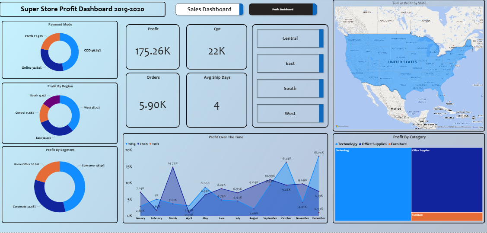

# 🏬 Super Store Sales and Profit Dashboard

---

## 📊 Overview
The **Super Store Sales Dashboard** is an interactive Power BI report that provides deep insights into sales performance across regions, product categories, and customer segments.  
It’s designed to help businesses make data-driven decisions by identifying key trends and profitability patterns.

---

## 🎯 Key Features
- **Sales & Profit Analysis** – Track total sales, profit, and quantity over time.  
- **Regional Insights** – Visualize performance across states and regions using maps.  
- **Category Breakdown** – Compare sales and profit across product categories and subcategories.  
- **Customer Analysis** – Identify top-performing customers and order behavior.  
- **Time-based Trends** – Drill down by year, quarter, month, and day for dynamic insights.  

---

## 🛠️ Tools & Technologies
| Tool | Purpose |
|------|----------|
| **Power BI Desktop** | Dashboard design and visualization |
| **Power Query** | Data cleaning and transformation |
| **Sample Superstore Dataset** | Data source used for analysis |
| **DAX** | Calculated measures and KPIs |

---

## 📈 Insights Highlight
- **Top Sales Regions:** Identify the regions contributing the highest revenue.  
- **High-Profit Categories:** Track which product categories drive profit margins.  
- **Discount Impact:** Analyze how discounts affect total profit.  
- **Year-over-Year Growth:** Visualize sales trends over multiple years.  

---

## 🧩 File Information
- **File Name:** `Super Store Sales Dashboard.pbit`  
- **File Type:** Power BI Template File  
- **Usage:** Open in Power BI Desktop → Connect to dataset → Refresh visuals  

---

## 💡 Objective
To showcase how Power BI can turn raw retail data into a visually compelling story that supports business intelligence and strategy development.

---

## 🚀 How to Use
1. Download the 
 file from this repository.  
2. Open it using **Power BI Desktop**.  
3. Load or connect your Superstore dataset.  
4. Explore the dashboard visuals interactively.  

---

## 🖼️ Screenshots
### 💰 Sales Overview
Shows total sales, quantity sold, and average sales per customer — helping identify top-performing segments.

---

### 📈 Profit Analysis
Highlights overall profit trends, profit ratio, and the impact of discounts on profitability.

